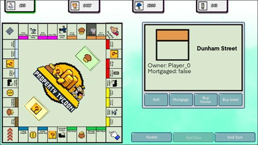

# Property Tycoon

A Monopoly-inspired digital board game built with Godot, using agile development principles.

Features CPUs, dynamic board generation from user-defined .json files, and core Monopoly features like buying, selling, houses, auctioning, and more.

